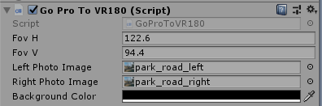

# Unity_GoProToVR180

Translated with Google Translate.    

[To Japanese document](README_jp.md)    

This is a sample project for viewing two photos taken with GoPro's wide angle as a VR on Unity.    
When shooting at a wide angle with GoPro, it looks like a fisheye, but it is close to a plane, so the parallax feels closer to reality than a VR180 camera.    

    

## Development environment

Unity 2018.3.8 (Windows)     
GoPro HERO7 Silver    

## Folder structure

    [Assets]    
      [GoProToVR180]    Required files (copy and use)    
        [Resources]
          [Objects]
          [Shaders]
        [Scripts]
      [images]             sample images
      [Scenes]
        SampleScene        sample scenes    

## How to use

Please turn on "Virtual Reality Supported" in "XR Settings" of "Project Settings".    

1. Copy the "GoProToVR180" folder to the project.    
2. Added "Scripts/GoProToVR180/GoProToVR180" to the MainCamera component.    
3. In the Inspector of MainCamera, specify the parameter of "GoProToVR180".    

| Parameter name| Description |
| :--- | :--- |
|FovH|Horizontal FOV|
|FovV|Vertical FOV|
|Left Photo Image|Photo from left eye|
|Right Photo Image|Photo from right eye|
|Background Color|Background color|

    

## Shooting with parallax in GoPro

When shooting with GoPro, shoot 2 images by shifting the IPD distance (64 mm) horizontally.    
    
At this time, the shooting was "4x3 wide angle".     

## View angle of GoPro

For GoPro HERO7, refer to the viewing angle information on the following page.    
https://gopro.com/help/articles/question_answer/hero7-field-of-view-fov-information    

Vertical FOV 94.4, Horizontal FOV 122.6 for 4x3 wide angle.    

## Sample Scenes

| Scene name | Description |
| :--- | :--- |
| SampleScene | Stereoscopically view two photos taken with GoPro with VR |

## Change log

### [04/08/2019]

- First verion
