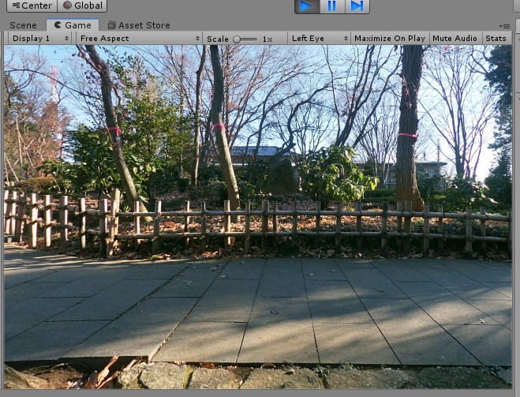
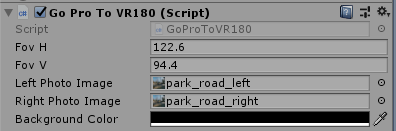
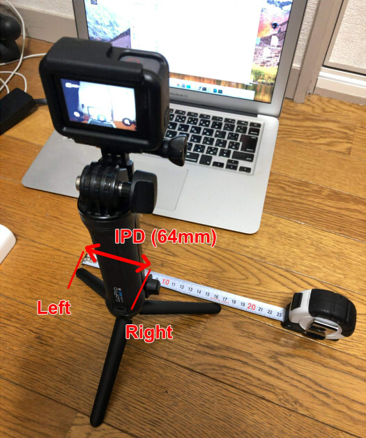

# Unity_GoProToVR180

[英語ドキュメントへ](README.md)    

GoProの広角で撮影した2枚の写真を、Unity上でVRとして見るためのサンプルプロジェクトです。    
GoProで広角で撮影した場合は、魚眼ではありますが平面に近いため、VR180カメラよりは奥行きの視差感が現実に近くなるようです。    

    

## 開発環境

Unity 2018.3.8 (Windows)     
GoPro HERO7 Silver    

## フォルダ構成

    [Assets]    
      [GoProToVR180]    必要なファイル（コピーして使用）    
        [Resources]
          [Objects]
          [Shaders]
        [Scripts]
      [images]             サンプル画像
      [Scenes]
        SampleScene        サンプルシーン    

## 使い方

"Project Settings"の"XR Settings"で"Virtual Reality Supported"をOnにして使用してください。    

1. "GoProToVR180"フォルダをプロジェクトにコピー。    
2. MainCameraのコンポーネントに"Scripts/GoProToVR180/GoProToVR180"を追加。    
3. MainCameraのInspectorで、"GoProToVR180"のパラメータを指定。    

| パラメータ名| 内容 |
| :--- | :--- |
|FovH|水平視野角|
|FovV|垂直視野角|
|Left Photo Image|左目から見た写真|
|Right Photo Image|右目から見た写真|
|Background Color|背景色|

    

## GoProでの視差を考慮した撮影

GoProでの撮影を行うとき、水平にIPD分（64mm）離して2枚撮影します。    
    
このとき、撮影は「4x3 広角」としました。     

## GoProの視野角度

GoPro HERO7の場合は、以下の視野角度を参考にしました。    
https://jp.gopro.com/help/articles/question_answer/hero7-field-of-view-fov-information    

4x3 広角の場合、垂直 FOV 94.4、水平 FOV 122.6。    

## サンプルシーン

| シーン名 | 説明 |
| :--- | :--- |
| SampleScene | GoProで撮影した2枚の写真をVRで立体視する |

## 更新履歴

### [04/08/2019]

- 最初のバージョン
